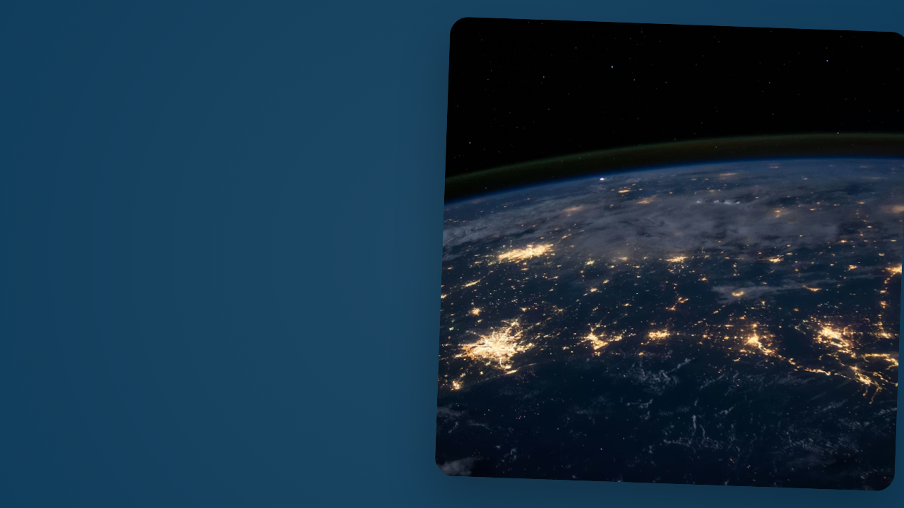
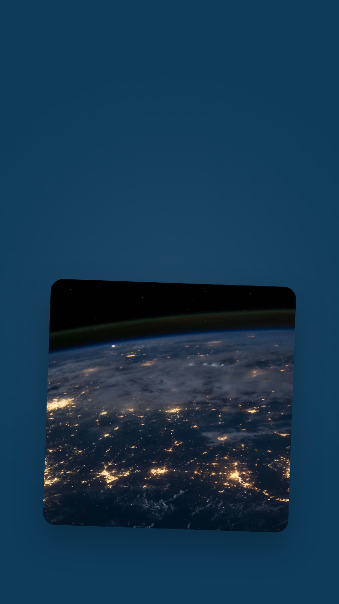
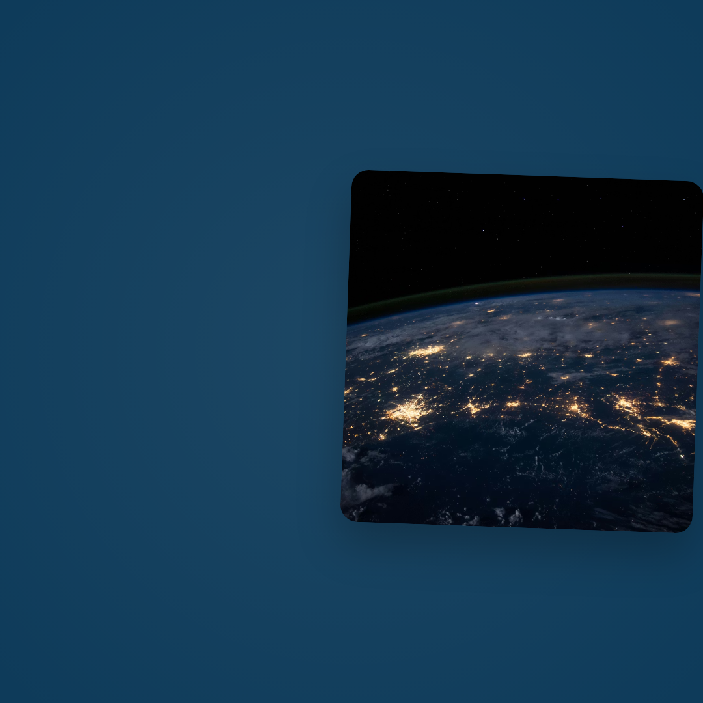

# Remotion AEM Spotlight

[](https://github.com/narendragandhi/remotion-aem-showcase/actions/workflows/ci.yml)
[](LICENSE)
[](./package.json)

A production-ready showcase demonstrating how AEM Content Fragments orchestrate Remotion video compositions. This project follows BMAD/BEAD methodologies and enforces TDD guardrails for enterprise-grade video delivery.

## Features

- **Multi-Channel Delivery**: 16:9, 9:16, 1:1, and 4K compositions from a single codebase
- **AEM Integration**: GraphQL-powered content from AEM as a Cloud Service
- **Animation Presets**: Cinematic, Energetic, and Minimal motion styles
- **WASM Effects**: Custom pulse/glitch math in WebAssembly with identical JS fallback
- **Type Safety**: Zod schema validation for all AEM data
- **Error Resilience**: Graceful fallbacks and error boundaries throughout

## Demo

Smoke-rendered stills from the latest build — all generated from a single AEM Content Fragment:

| 16:9 — Desktop / YouTube | 9:16 — Stories / Reels | 1:1 — Feed / LinkedIn |
|:---:|:---:|:---:|
|  |  |  |

> Full video renders (`.mp4`) are attached to each [GitHub Release](https://github.com/narendragandhi/remotion-aem-showcase/releases).

---

## Quick Start

```bash
# Install dependencies
npm install

# Start Remotion preview
npm run start

# Run tests
npm run test

# Type check
npm run type-check

# Render all formats
npm run render:all
```

## Project Structure

```
remotion-aem-showcase/
├── src/
│   ├── index.tsx                   # Composition registry
│   ├── aem/
│   │   ├── aemClient.ts           # AEM GraphQL client
│   │   ├── aemClient.test.ts      # TDD test suite
│   │   └── schema.ts              # Zod validation schemas
│   ├── compositions/
│   │   └── SpotlightComposition.tsx  # Main video component
│   ├── components/
│   │   └── ErrorBoundary.tsx      # Error handling UI
│   ├── errors/
│   │   └── index.ts               # Typed error classes
│   ├── wasm/
│   │   ├── spotlightEffects.ts    # WASM loader + JS fallback
│   │   ├── spotlightEffects.test.ts
│   │   ├── spotlight_effects.wat  # WASM source
│   │   └── spotlight_effects.wasm # Compiled binary
│   └── mock/
│       └── aem.json               # Mock content fragment data
├── public/
│   └── spotlight_effects.wasm     # Static WASM asset
├── docs/
│   ├── bmad-spec.md              # BMAD phases & acceptance criteria
│   ├── bead-tasks.md             # BEAD task tracking
│   ├── domain-model.md           # DDD bounded contexts
│   ├── gastown-orchestration.md  # AI agent orchestration
│   └── wasm-workflow.md          # WASM integration guide
├── remotion.config.ts             # Remotion CLI configuration
├── vitest.config.ts               # Test configuration
└── package.json
```

## Environment Configuration

Copy `.env.example` to `.env` and configure:

```bash
# AEM Cloud Service
AEM_BASE_URL=https://publish-p12345-e67890.adobeaemcloud.com
AEM_TOKEN=<your-ims-bearer-token>
AEM_GRAPHQL_ENDPOINT=/content/graphql/global/endpoint
AEM_CONTENT_FRAGMENT_PATH=/content/dam/your-project/spotlight

# Optional: Use persisted query for CDN caching
# AEM_PERSISTED_QUERY=/your-project/spotlight-query

# Development mode
USE_MOCK_AEM=true
```

## Available Scripts

| Command | Description |
|---------|-------------|
| `npm start` | Launch Remotion preview |
| `npm test` | Run Vitest test suite |
| `npm run test:watch` | Run tests in watch mode |
| `npm run test:coverage` | Generate coverage report |
| `npm run render` | Render default composition |
| `npm run render:all` | Render all aspect ratios |
| `npm run test:smoke` | Generate PNG stills for verification |
| `npm run lint` | ESLint check |
| `npm run lint:fix` | Auto-fix lint issues |
| `npm run format` | Prettier formatting |
| `npm run type-check` | TypeScript validation |
| `npm run validate` | Run all checks (type-check + lint + test) |
| `npm run build:wasm` | Rebuild WASM binary |
| `npm run deploy:aem` | (Experimental) Render and upload to AEM |

## Production Deployment

### 1. AEM Configuration
The project includes reference configurations in `/aem-config`:
- **Content Fragment Model**: `spotlight-cfm.json` (Blueprint for AEM).
- **CORS Policy**: `CORSPolicyImpl~spotlight.cfg.json` (Required for cross-origin asset access).

### 2. Upload to AEM Assets
After rendering, you can upload the final video to the AEM DAM:
```bash
# Set AEM Author tier credentials
export AEM_BASE_URL=https://author-p12345-e67890.adobeaemcloud.com
export AEM_TOKEN=<ims-bearer-token>

# Upload rendered video
node scripts/upload-to-aem.js out/spotlight_16x9.mp4 /content/dam/spotlight/videos/hero_spotlight.mp4
```

## Compositions

| ID | Dimensions | Use Case |
|----|------------|----------|
| `AEMSpotlight-16x9` | 1280x720 | YouTube, Desktop, TV |
| `AEMSpotlight-9x16` | 720x1280 | Instagram Stories, TikTok, Reels |
| `AEMSpotlight-1x1` | 1080x1080 | Instagram Feed, LinkedIn |
| `AEMSpotlight-4K` | 3840x2160 | Premium content |

## AEM Content Fragment Model

The spotlight expects content fragments with these fields:

| Field | Type | Description |
|-------|------|-------------|
| `title` | Text | Hero headline |
| `subtitle` | Text | Supporting line |
| `cta` | Text | Call-to-action button text |
| `brandColor` | Text | Background color (CSS hex) |
| `image` | Content Reference | Hero image asset |
| `durationSeconds` | Number | Scene duration |
| `animationStyle` | Enum | `cinematic`, `energetic`, `minimal` |
| `renditionType` | Enum | `web`, `optimized`, `original` |
| `effectType` | Enum | `none`, `glow`, `glitch` |
| `effectIntensity` | Number | 0.0 to 1.0 |
| `lottieUrl` | Text | URL to Lottie JSON |
| `svgOverlayUrl` | Text | URL to SVG overlay |

For multi-scene videos, use a Container Fragment with nested scene fragments.

## Architecture

### Data Flow

```
AEM Content Fragment
    ↓ GraphQL API
fetchAemSpotlight()
    ↓ Zod Validation
AemSpotlight aggregate
    ↓ Props
SpotlightComposition
    ↓ Series Sequencing
SpotlightSceneComponent (per scene)
    ↓ WASM Effects
Rendered Video
```

### Error Handling

The application uses typed errors for different failure modes:

- `AemFetchError` - GraphQL request failures
- `AemValidationError` - Invalid response data
- `WasmLoadError` - WASM module load failures
- `AssetLoadError` - Image/Lottie/SVG load failures

All errors are recoverable with graceful fallbacks to mock data or placeholder UI.

### WASM Effects

The project implements custom pulse and glitch math in a hand-written `.wat` module,
loaded via Remotion's `staticFile()` helper with an identical JS fallback.

- **Pulse/Glow**: Smooth CTA button glow driven by normalised frame progress
- **Glitch**: Pseudo-random distortion applied to hue-rotate and translate transforms

The WASM value here is demonstrating the integration pattern (async load, `delayRender`
gating, graceful fallback) rather than raw compute performance — the JS fallback
produces identical output. A real production use case would move heavier per-frame
processing (colour grading, noise generation) into WASM.

## Development

### TDD Workflow

1. Write tests in `src/**/*.test.ts`
2. Run `npm run test:watch`
3. Implement feature
4. Verify with `npm run validate`

### Adding New Effects

1. Update `spotlight_effects.wat` with new function
2. Run `npm run build:wasm` to regenerate binary
3. Add corresponding JS fallback in `spotlightEffects.ts`
4. Export new function and add tests

## Deployment

### CI/CD Integration

```yaml
# Example GitHub Action
- name: Install dependencies
  run: npm ci

- name: Validate
  run: npm run validate

- name: Render videos
  run: npm run render:all

- name: Upload to AEM Assets
  run: # Your upload script
```

### Environment Variables for CI

Set these secrets in your CI environment:

- `AEM_BASE_URL` - AEM Cloud Service URL
- `AEM_TOKEN` - IMS Service Account token

## Methodology

This project follows:

- **BMAD** (Build/Model/Analyze/Document) for spec-driven development
- **BEAD** (Build/Execute/Analyze/Document) for task tracking
- **Gastown** for AI agent orchestration
- **DDD** (Domain-Driven Design) for bounded contexts
- **TDD** for test-first development

See `/docs` for detailed methodology documentation.

## Additional Documentation

| Document | Description |
|----------|-------------|
| [AEM Integration Guide](docs/aem-integration-guide.md) | Live AEM endpoints, sandbox setup, authentication |
| [Performance Profiling](docs/performance-profiling.md) | WASM vs JS benchmarks, optimization strategies |
| [Monitoring & Observability](docs/monitoring-observability.md) | Telemetry, error tracking, alerting |
| [TUTORIAL.md](TUTORIAL.md) | 10-minute quick start guide |
| [EXAMPLES.md](EXAMPLES.md) | Enterprise use case examples |

## License

Apache 2.0 — see [LICENSE](./LICENSE)

## Contributing

1. Create feature branch from `main`
2. Follow TDD workflow
3. Ensure `npm run validate` passes
4. Submit PR with BEAD task reference
